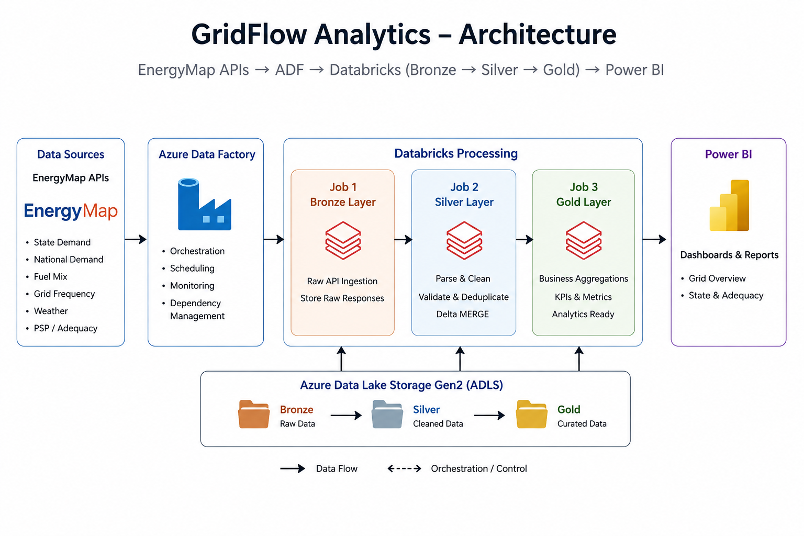
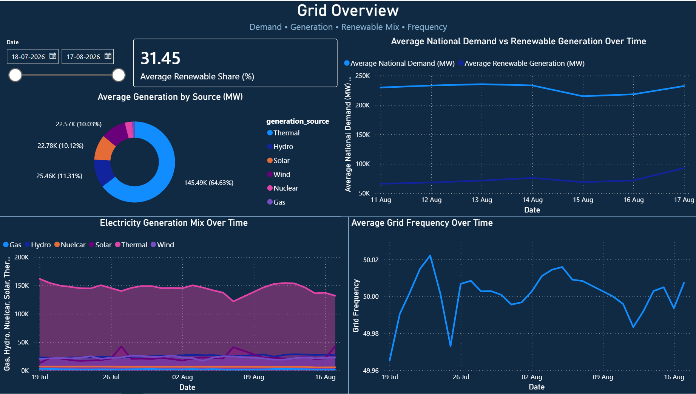
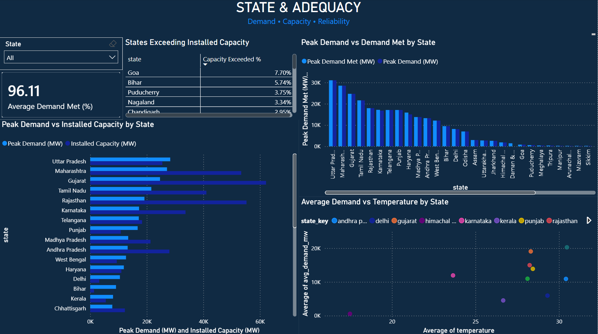

# GridFlow Analytics

## Electricity Data Engineering & Analytics Platform

GridFlow Analytics is an end-to-end Azure Data Engineering and electricity analytics portfolio project.

The platform ingests electricity, weather, generation-mix, grid-frequency, and adequacy data from EnergyMap APIs, processes the data through a Bronze → Silver → Gold architecture, and publishes curated analytics through Power BI.

The project is designed to demonstrate practical Data Engineering skills using Azure, Databricks, PySpark, Delta Lake, Python packaging, GitHub, and CI/CD.

---

## Architecture

The GridFlow Analytics platform follows a simple Azure-based data engineering architecture:

EnergyMap APIs → Azure Data Factory → Databricks Bronze → Silver → Gold → Power BI

<p align="center">
  
</p>

Azure Data Factory is responsible for orchestration, dependencies, scheduling, monitoring, and reprocessing.

Databricks performs distributed Spark processing.

ADLS Gen2 provides the storage layer for Bronze, Silver, and Gold data.

See the `architecture/` directory for the architecture diagram and architecture decisions.

---

## Technology Stack

* Azure Data Factory
* Azure Data Lake Storage Gen2
* Azure Databricks
* Apache Spark / PySpark
* Delta Lake
* Python
* GitHub
* GitHub Actions
* Power BI

---

## Data Domains

GridFlow works with several electricity-system data domains:

* State electricity demand
* National electricity demand
* National fuel mix
* Grid frequency
* Weather
* PSP / system adequacy

---

## Medallion Architecture

### Bronze

Bronze preserves raw API responses with ingestion metadata.

Typical metadata includes:

* Source
* Dataset
* Requested time window
* Ingestion timestamp
* Raw API response

Bronze provides a replayable source layer and protects the pipeline from losing the original API response.

### Silver

Silver converts raw API responses into canonical analytical records.

Responsibilities include:

* JSON parsing
* Flattening nested API structures
* Type conversion
* Timestamp normalization
* Data validation
* Deduplication
* Delta Lake MERGE
* Provenance preservation

Official and modeled observations remain distinguishable through source and source-type metadata rather than being silently discarded.

### Gold

Gold contains business-oriented, analytics-ready datasets.

Examples include:

* State demand analytics
* National grid analytics
* State adequacy analytics
* State weather-demand analytics

Gold transformations calculate business metrics and prepare the data for Power BI.

---

## Incremental Processing

The project uses different incremental strategies for Silver and Gold.

### Silver

Silver uses the Bronze ingestion timestamp as its processing watermark.

```text
Bronze
   |
   v
MAX(Silver.ingestion_timestamp)
   |
   v
Process newer Bronze records
   |
   v
Delta MERGE
```

If Silver does not exist, the pipeline performs a full historical bootstrap.

### Gold

Gold uses a rolling two-day rebuild rather than treating Gold processing time as a source watermark.

```text
Gold through date D
       |
       v
Recalculate from D - 2 days
       |
       v
Aggregate complete Silver data
       |
       v
MERGE recent Gold results
```

This approach handles late-arriving data, overlapping ingestion windows, and recent corrections without introducing unnecessary audit infrastructure.

---

## Ingestion Strategy

The project uses a historical bootstrap followed by overlapping daily ingestion.

```text
Bootstrap
~60 days

        ↓

Normal daily processing
48-hour API window
```

The 48-hour overlap provides recovery if a daily run fails.

Overlapping observations are handled through Silver business keys and Delta MERGE rather than being hidden with blanket deduplication.

---

## Python Package

The project is implemented as an installable Python package.

```text
src/
└── gridflow_analytics/
    ├── common/
    └── processing/
```

Imports use the installed package:

```python
from gridflow_analytics...
```

The project is packaged as a Python Wheel for Databricks execution.

---

## Azure Data Factory

ADF definitions are maintained in:

```text
adf/
├── datasets/
├── linkedServices/
├── pipelines/
└── triggers/
```

ADF acts as the orchestration layer while Databricks handles Spark processing.

The separation allows the project to demonstrate both Azure orchestration and distributed data processing.

---

## Security

Sensitive API credentials are stored using Databricks Secrets and retrieved at runtime.

The project follows the principle of keeping credentials outside application source code.

---

## Power BI

The final Power BI report contains two main pages.

## Power BI Dashboard

### Grid Overview

<p align="center">
  
</p>

### State & Adequacy

<p align="center">
  
</p>

### Grid Overview

Provides a national/grid-level view of:

* Electricity demand
* Generation
* Renewable share
* Generation mix
* Grid frequency
* Trends over time

### State & Adequacy

Provides state-level analysis of:

* Demand
* Demand met
* Peak demand
* Installed capacity
* Capacity exceptions
* Weather versus demand

The report uses a dark electricity-themed design with business-facing labels and focused visuals.

---

## Engineering Principles

The project follows a few core principles:

1. **Accuracy over unnecessary complexity**
2. **Preserve raw source data**
3. **Do not fabricate analytical values**
4. **Keep official and modeled data distinguishable**
5. **Use dataset-specific business keys**
6. **Handle overlapping ingestion deterministically**
7. **Use Delta MERGE for incremental processing**
8. **Keep architecture simple and explainable**
9. **Do not solve data-quality problems by hiding them**

---

## Repository Structure

```text
gridflow_analytics/
│
├── .github/
│   └── workflows/
│
├── adf/
│   ├── datasets/
│   ├── linkedServices/
│   ├── pipelines/
│   └── triggers/
│
├── architecture/
│
├── dashboard/
│
├── docs/
│
├── src/
│   └── gridflow_analytics/
│       ├── common/
│       └── processing/
│
├── .gitignore
├── pyproject.toml
└── README.md
```

---

## CI/CD

GitHub Actions is used for validation and deployment.

### CI

CI validates the Python project by:

* Compiling Python source
* Building the Python Wheel
* Verifying Wheel contents
* Installing the generated package
* Verifying the installed distribution

### CD

CD is manually triggered when a deployment is required.

The workflow:

```text
GitHub
   |
   v
Build Python Wheel
   |
   v
Upload Wheel
   |
   v
Databricks
```

The repository uses:

```text
feature/*
      |
      v
   develop
      |
      v
    main
```

`develop` is used for integration and validation, while `main` represents the stable project state.

---

## Key Design Decisions

### Why Azure Data Factory?

ADF provides orchestration, dependencies, scheduling, monitoring, retries, and controlled reprocessing while Databricks focuses on distributed Spark processing.

### Why Databricks?

Databricks provides a practical Spark execution environment for processing the electricity datasets and running the Python Wheel.

### Why Delta Lake?

Delta provides reliable table storage and supports MERGE-based incremental processing.

### Why Bronze → Silver → Gold?

The separation keeps raw source data, cleaned canonical data, and business analytics distinct.

## Project Outcome

GridFlow demonstrates an end-to-end Azure Data Engineering workflow:

```text
API ingestion
      ↓
ADF orchestration
      ↓
ADLS Bronze
      ↓
Databricks / PySpark
      ↓
ADLS Silver / Delta
      ↓
Databricks / PySpark
      ↓
ADLS Gold / Delta
      ↓
Power BI
```

The result is a structured electricity analytics platform that combines multiple grid-related data domains into curated datasets for business analysis using publicly available API's as source.


## Documentation

For more information about the project architecture, data pipeline, and implementation details, refer to the technical documentation stored in:

`docs/Technical_Documentation.pdf`